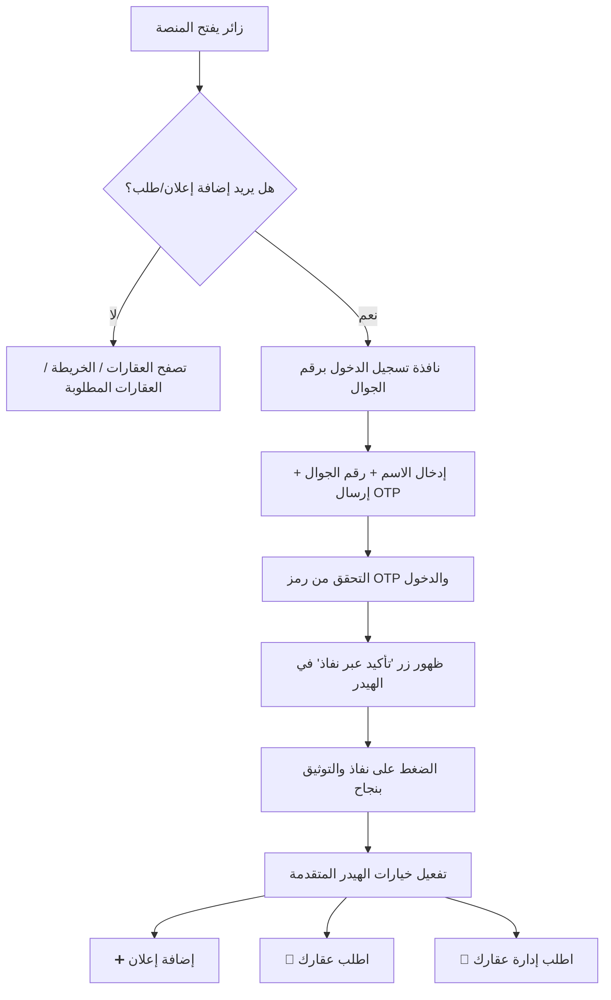
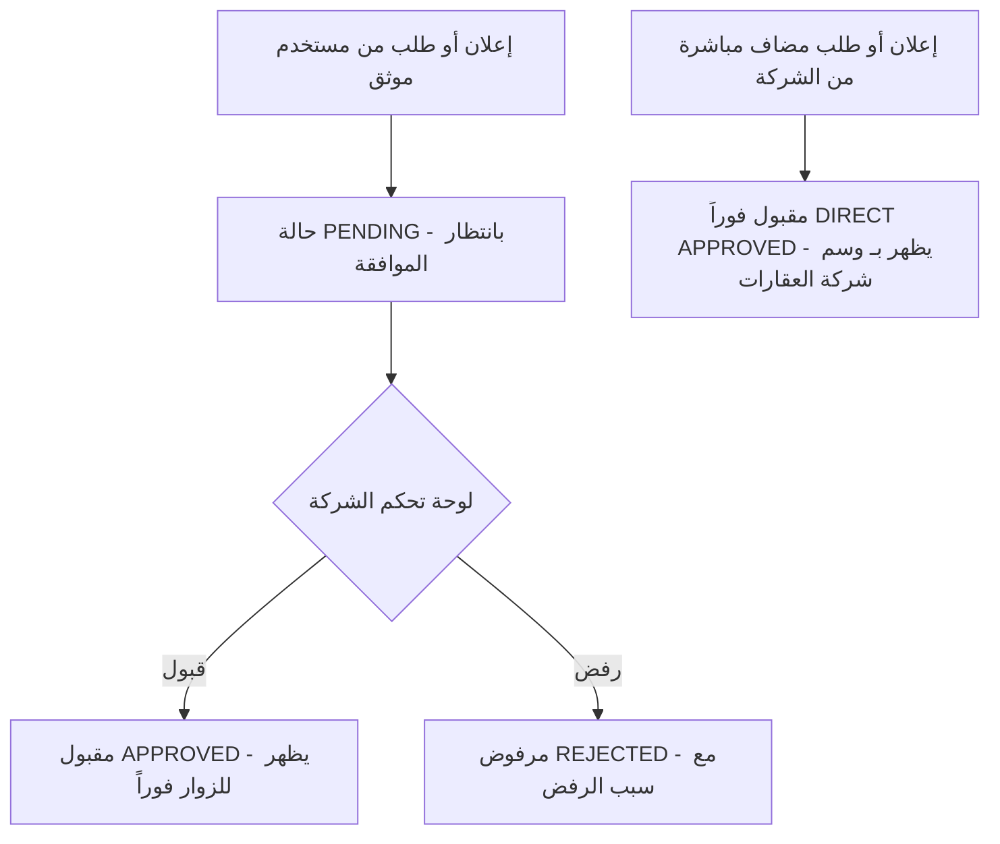

# 📑 خطة العمل الشاملة والمفصلة: منصة العقارات السعودية

مرحباً بك. تهدف هذه الوثيقة إلى تقديم **خطة هندسية وإجرائية متكاملة** لبناء منصة عقارات سعودية حديثة ومتجاوبة **ثنائية اللغة (عربي + إنجليزي)** تخدم كلاً من الزوار، مستخدمي المنصة الموثقين، والشركة العقارية المالكة للمنصة.

---

## 📐 1. التقنيات المعتمدة (Technology Stack)

| العنصر | التقنية المختارة | السبب والفوائد |
| :--- | :--- | :--- |
| **إطار العمل (Fullstack)** | `Next.js 16 (React 19 / TypeScript)` | أفضل أداء وأعلى سرعة تحميل وأرشفة ممتازة في محركات البحث (SEO). |
| **قاعدة البيانات (Database)** | `MariaDB` (متوافقة مع MySQL) | قاعدة بيانات علاقاتية قوية وشائعة جداً ومناسبة للبيانات المكانية والعناوين. |
| **محرّك الجداول (ORM)** | `Prisma ORM v7` | لبناء الجداول والـ Queries بكفاءة عالية ونظافة كود ممتازة. |
| **خدمة الخرائط (Maps)** | `Google Maps API` via `@vis.gl/react-google-maps` | لعرض الخرائط بدقة متناهية ودبابيس تفاعلية مألوفة للمستخدمين في السعودية. |
| **الهوية البصرية والتصميم** | `Tailwind CSS v4 + Vanilla CSS` | تصميم نظيف Mobile-first، Light Mode فقط، لون ماروني من الشعار + محايدات. |
| **الأيقونات** | `Lucide React` | مكتبة أيقونات حديثة وخفيفة ومتوافقة مع React. |
| **نظام التسجيل والتحقق** | `SMS OTP + Nafath SSO` | نظام محاكاة/تكامل إرسال رموز SMS وتوثيق نفاذ الوطني. |
| **إدارة الجلسات (Auth)** | `iron-session` (JWT مشفر في cookies) | خفيف وآمن ومناسب لنظام OTP بدون مكتبات ثقيلة. |
| **التحقق من المدخلات** | `Zod` | التحقق من البيانات server-side و client-side بنفس الـ schema. |
| **تخزين الصور** | `Local Filesystem` (`/uploads`) + `sharp` | تخزين الصور على السيرفر مباشرة مع ضغط وتحسين تلقائي عبر `sharp` (مدمج مع Next.js). |
| **دعم اللغتين (i18n)** | `next-intl` | لدعم العربية والإنجليزية مع تبديل تلقائي لاتجاه الصفحة (RTL/LTR). |

### 📁 استراتيجية تخزين الصور:
- الصور تُرفع إلى مجلد `/uploads/properties/[propertyId]/` على السيرفر.
- عند الرفع، يتم ضغط الصور وتحويلها لصيغة `WebP` عبر مكتبة `sharp` لأفضل أداء.
- يتم إنشاء نسخة مصغرة (thumbnail) تلقائياً لكل صورة لعرضها في البطاقات.
- حد أقصى للرفع: **10 صور لكل إعلان**، حجم أقصى **5MB** للصورة الواحدة.
- المسار يُحفظ في قاعدة البيانات في جدول `PropertyImage` المنفصل.

---

## 🎨 1.5 الهوية البصرية (Brand Identity)

### البراند:
- **الاسم:** رزيم العقارية — Razeem Real Estate
- **الشعار:** `Razeem Skyline Concepts-selection.png` (شعار بخلفية شفافة — خط عربي مدمج مع skyline مباني)

### الألوان:
- **اللون الأساسي الوحيد:** `#3B1520` (الماروني الداكن — مستخرج من الشعار)
- **الباقي كله محايد:** أبيض + درجات الرمادي + أسود
- **التصميم نظيف وبسيط** — لون واحد فقط يميّز المنصة، بدون ألوان إضافية
- **Light Mode فقط** — لا يوجد وضع مظلم
- **متوافق مع الموبايل** — Mobile-first، أزرار كبيرة للمس، خطوط مقروءة
- التوزيع والتباين يتحددوا أثناء البناء عبر مهارة `web-design-guidelines`

---

## 🔄 2. مسارات العمل والتدفق (User Flow Diagrams)

### أ) رحلة الزائر والدخول والتوثيق عبر نفاذ:

### ب) رحلة الموافقة الإدارية وإعلانات الشركة:

---

## 🗄️ 3. نموذج قاعدة البيانات (Database Schema Structure)

سيتم إنشاء الجداول التالية في `MariaDB` عبر `Prisma Schema`:

### 1. جدول المستخدمين (`User`):
| الحقل | النوع | الوصف |
|:---|:---|:---|
| `id` | String (cuid) | معرف فريد |
| `name` | String | اسم المستخدم |
| `phone` | String (unique) | رقم الجوال (فريد) |
| `isNafathVerified` | Boolean | حالة التوثيق بنفاذ |
| `role` | Enum | `USER` للمستخدمين، `COMPANY_ADMIN` لإدارة الشركة |
| `createdAt` | DateTime | تاريخ الإنشاء |
| `updatedAt` | DateTime | تاريخ آخر تعديل |

### 2. جدول رموز التحقق (`OtpSession`):
| الحقل | النوع | الوصف |
|:---|:---|:---|
| `id` | String (cuid) | معرف فريد |
| `phone` | String | رقم الجوال |
| `code` | String | رمز التحقق (6 أرقام) |
| `expiresAt` | DateTime | وقت انتهاء صلاحية الرمز |
| `verified` | Boolean | هل تم التحقق بنجاح |
| `attempts` | Int | عدد محاولات الإدخال (حد أقصى 3) |
| `createdAt` | DateTime | تاريخ الإنشاء |

### 3. جدول العقارات المعروضة (`Property`):
| الحقل | النوع | الوصف |
|:---|:---|:---|
| `id` | String (cuid) | معرف العقار |
| `title` | String | عنوان الإعلان |
| `description` | Text | تفاصيل العقار |
| `category` | Enum | `APARTMENT` شقة، `OFFICE` مكتب، `ROOM` غرفة، `VILLA` فيلا، `LAND` أرض |
| `type` | Enum | `RENT` إيجار، `SALE` بيع |
| `price` | Decimal | السعر بالريال السعودي |
| `area` | Float | المساحة بالمتر المربع |
| `bedrooms` | Int | عدد غرف النوم |
| `bathrooms` | Int | عدد دورات المياه |
| `city` | String | المدينة |
| `district` | String | الحي |
| `latitude` | Float | خط العرض على الخريطة |
| `longitude` | Float | خط الطول على الخريطة |
| `status` | Enum | `PENDING`, `APPROVED`, `REJECTED` |
| `rejectionReason` | String? | سبب الرفض (اختياري، يُملأ عند الرفض) |
| `publisherType` | Enum | `COMPANY` الشركة، `VERIFIED_USER` مستخدم موثق |
| `userId` | String | المعرف المربوط بصاحب الإعلان |
| `views` | Int | عدد مرات المشاهدة |
| `createdAt` | DateTime | تاريخ الإنشاء |
| `updatedAt` | DateTime | تاريخ آخر تعديل |

### 4. جدول صور العقارات (`PropertyImage`):
| الحقل | النوع | الوصف |
|:---|:---|:---|
| `id` | String (cuid) | معرف فريد |
| `propertyId` | String | معرف العقار المرتبط |
| `url` | String | مسار الصورة الأصلية |
| `thumbnailUrl` | String | مسار الصورة المصغرة |
| `order` | Int | ترتيب عرض الصورة |
| `createdAt` | DateTime | تاريخ الإنشاء |

### 5. جدول العقارات المطلوبة (`PropertyRequest`):
| الحقل | النوع | الوصف |
|:---|:---|:---|
| `id` | String (cuid) | معرف الطلب |
| `title` | String | عنوان الطلب |
| `category` | Enum | نوع العقار المطلوب |
| `city` | String | المدينة المستهدفة |
| `district` | String | الحي المستهدف |
| `budget` | Decimal | الميزانية المتوقعة |
| `status` | Enum | `PENDING`, `APPROVED`, `REJECTED` |
| `rejectionReason` | String? | سبب الرفض (اختياري) |
| `publisherType` | Enum | `COMPANY`, `VERIFIED_USER` |
| `userId` | String | المعرف المربوط بصاحب الطلب |
| `createdAt` | DateTime | تاريخ الإنشاء |
| `updatedAt` | DateTime | تاريخ آخر تعديل |

### 6. جدول طلبات إدارة الأملاك (`ManagementRequest`):
| الحقل | النوع | الوصف |
|:---|:---|:---|
| `id` | String (cuid) | معرف الطلب |
| `ownerName` | String | اسم صاحب العقار |
| `phone` | String | رقم الجوال |
| `propertyType` | String | نوع العقار المراد إدارته |
| `city` | String | المدينة |
| `district` | String | الحي |
| `notes` | Text? | ملاحظات وتفاصيل إضافية |
| `status` | Enum | `NEW`, `CONTACTED`, `CLOSED` |
| `userId` | String | المعرف المربوط بصاحب الطلب |
| `createdAt` | DateTime | تاريخ الإنشاء |
| `updatedAt` | DateTime | تاريخ آخر تعديل |

### 7. جدول المفضلات (`Favorite`):
| الحقل | النوع | الوصف |
|:---|:---|:---|
| `id` | String (cuid) | معرف فريد |
| `userId` | String | معرف المستخدم |
| `propertyId` | String | معرف العقار المحفوظ |
| `createdAt` | DateTime | تاريخ الإضافة |

> **ملاحظة:** تُفرض قيود `@@unique([userId, propertyId])` على جدول المفضلات لمنع التكرار.

---

## 🖥️ 4. مواصفات الواجهات والتصفح (Pages Breakdown)

### الصفحات الأساسية:

| الصفحة | المسار | الوصف |
|:---|:---|:---|
| الصفحة الرئيسية | `/` | شريط بحث سريع، أحدث العقارات، إحصائيات المنصة |
| قائمة العقارات | `/properties` | شبكة بطاقات مع فلترة متقدمة (نوع، مدينة، سعر، مساحة) مع Pagination |
| تفاصيل العقار | `/properties/[id]` | معرض صور، تفاصيل كاملة، موقع على الخريطة، بيانات التواصل مع المعلن |
| الخريطة التفاعلية | `/map` | خريطة كاملة من Google Maps بدبابيس تفاعلية حسب نوع العقار |
| العقارات المطلوبة | `/requests` | جدول استعراض طلبات البحث عن عقار والتواصل مع صاحب الطلب |
| حسابي | `/profile` | بيانات المستخدم، حالة التوثيق، إعلاناته وطلباته وحالاتها |
| إعلاناتي | `/my-listings` | إدارة إعلانات المستخدم (تعديل / حذف / متابعة الحالة) |
| المفضلة | `/favorites` | العقارات المحفوظة من قبل المستخدم |
| من نحن | `/about` | معلومات عن الشركة ورؤيتها |
| تواصل معنا | `/contact` | نموذج تواصل مع الشركة |
| صفحة 404 | `not-found` | صفحة خطأ مخصصة بتصميم متناسق |

### صفحات لوحة التحكم (الشركة):

| الصفحة | المسار | الوصف |
|:---|:---|:---|
| لوحة التحكم الرئيسية | `/admin` | إحصائيات عامة ونظرة شاملة |
| إدارة الإعلانات | `/admin/properties` | الموافقة والرفض مع كتابة سبب الرفض |
| إدارة الطلبات | `/admin/requests` | الموافقة والرفض على طلبات العقارات |
| نشر إعلان الشركة | `/admin/publish` | النشر المباشر باسم الشركة (بدون مراجعة) |
| طلبات إدارة الأملاك | `/admin/management` | متابعة طلبات إدارة الأملاك وتحديث حالتها |

### مكونات الواجهة المشتركة:

| المكون | الوصف |
|:---|:---|
| **Header** | شعار المنصة، التنقل، زر الدخول/التسجيل، زر نفاذ، الأزرار الثلاثة (بعد التوثيق)، زر تبديل اللغة (AR/EN) |
| **Footer** | روابط سريعة، معلومات التواصل، حقوق النشر |
| **Filter Bar** | شريط فلترة ذكي (نوع العقار، المدينة، نطاق السعر، المساحة) |
| **Property Card** | بطاقة العقار مع صورة مصغرة، السعر، الموقع، وسم الشركة/الفرد |
| **Loading Skeletons** | حالات تحميل بتصميم Skeleton لكل صفحة |

---

## 🛡️ 5. الأداء والأمان (Performance & Security)

### أ) الأمان:
- **Input Validation:** التحقق من جميع المدخلات عبر `Zod` في الـ Server Actions و API Routes.
- **Input Sanitization:** تنظيف المدخلات من أي أكواد ضارة (XSS Prevention).
- **Rate Limiting:** تحديد عدد الطلبات لكل IP (خصوصاً على نقاط OTP و API).
- **CSRF Protection:** حماية النماذج من هجمات Cross-Site Request Forgery.
- **Secure Sessions:** تشفير بيانات الجلسة عبر `iron-session` مع HttpOnly cookies.
- **File Upload Validation:** التحقق من نوع وحجم الملفات المرفوعة قبل الحفظ.

### ب) الأداء:
- **Pagination:** نظام صفحات (cursor-based) لتحميل العقارات تدريجياً.
- **Image Optimization:** ضغط الصور تلقائياً عبر `sharp` وتحويلها لـ WebP.
- **Caching:** استراتيجية كاش عبر Next.js ISR (Incremental Static Regeneration) للصفحات العامة.
- **Lazy Loading:** تحميل الصور والخرائط عند الحاجة فقط.
- **Database Indexes:** فهارس على الحقول المستخدمة في البحث والفلترة (`city`, `category`, `type`, `status`, `price`).

### ج) تجربة المستخدم:
- **Light Mode فقط:** لا يوجد وضع مظلم — تصميم فاتح ونظيف.
- **Bilingual (AR/EN):** دعم كامل للعربية والإنجليزية مع تبديل فوري للغة والاتجاه.
- **RTL/LTR Auto:** تبديل تلقائي لاتجاه الصفحة حسب اللغة (عربي RTL، إنجليزي LTR).
- **Mobile-first:** التصميم يبدأ من الموبايل (375px) ويتوسع للشاشات الأكبر.
- **Touch-friendly:** أزرار ومناطق لمس لا تقل عن 44×44px، خطوط 16px+ لمنع zoom تلقائي.
- **Loading States:** حالات تحميل Skeleton لكل صفحة ومكون.
- **Error Handling:** صفحات خطأ مخصصة ورسائل خطأ واضحة بالعربي والإنجليزي.

---

## 🔍 6. السيو والأرشفة (SEO Strategy)

- **Meta Tags:** عنوان ووصف ديناميكي لكل صفحة عقار.
- **Open Graph:** بيانات مشاركة اجتماعية لكل إعلان (صورة + عنوان + وصف).
- **JSON-LD Structured Data:** بيانات منظمة من نوع `RealEstateListing` لمحركات البحث.
- **Sitemap:** خريطة موقع ديناميكية تتحدث تلقائياً بالإعلانات المقبولة.
- **robots.txt:** ملف توجيه لمحركات البحث.
- **Semantic HTML:** استخدام عناصر HTML الدلالية الصحيحة.

---

## 🌍 7. دعم اللغتين (Internationalization — i18n)

### الإعداد:
- مكتبة `next-intl` لإدارة الترجمة والتوجيه.
- **اللغة الافتراضية:** العربية (`ar`).
- **اللغة الثانية:** الإنجليزية (`en`).
- المسارات تبدأ بكود اللغة: `/ar/properties`, `/en/properties`.
- ملفات الترجمة: `src/messages/ar.json` و `src/messages/en.json`.

### آلية العمل:
- زر تبديل اللغة (AR ↔ EN) ثابت في الـ Header.
- عند تبديل اللغة يتغير:
  - **النصوص:** جميع العناصر المرئية.
  - **الاتجاه:** `dir="rtl"` للعربي، `dir="ltr"` للإنجليزي.
  - **الخط:** خط عربي (IBM Plex Sans Arabic) أو إنجليزي (Geist/Inter).
  - **المسار:** `/ar/...` أو `/en/...`.
- بيانات العقارات (العنوان، الوصف) تُحفظ بلغة واحدة كما أدخلها صاحب الإعلان.
- عناصر الواجهة الثابتة (أزرار، قوائم، تسميات) مترجمة بالكامل.

### البنية في التطبيق:
- `src/app/[locale]/` — كل الصفحات تحت مسار اللغة.
- `src/messages/ar.json` — جميع النصوص العربية.
- `src/messages/en.json` — جميع النصوص الإنجليزية.
- Middleware لتوجيه المستخدم تلقائياً حسب لغة المتصفح.

---

## 🔔 8. نظام الإشعارات (Notifications)

- **إشعارات داخل المنصة:** عند قبول أو رفض الإعلان/الطلب تظهر إشعارة للمستخدم في الهيدر.
- **رسائل الحالة:** تحديث فوري لحالة الإعلان في صفحة "إعلاناتي" و "حسابي".
- **قابل للتوسعة:** البنية جاهزة لإضافة إشعارات SMS أو Email مستقبلاً.

---

## 🚀 9. مراحل التنفيذ المتتابعة (Phases Roadmap)

### المرحلة 0: الإعداد والتهيئة (Setup & Configuration)
- إعداد بنية المجلدات (folder structure).
- إعداد متغيرات البيئة (`.env`).
- تهيئة Prisma مع MariaDB.
- تهيئة `next-intl` ودعم اللغتين (AR/EN) مع Middleware.
- تهيئة الخطوط العربية والإنجليزية والـ RTL/LTR layout.
- إنشاء ملفات الترجمة الأساسية (`ar.json`, `en.json`).
- إعداد ملفات التكوين (ESLint, TypeScript paths).

### المرحلة 1: قاعدة البيانات والبيانات التجريبية
- إنشاء بنية قاعدة البيانات (Prisma Models) بجميع الجداول.
- إعداد Zod schemas متطابقة مع Prisma models.
- توليد البيانات الأولية التجريبية (Seed Data) بعقارات ومستخدمين تجريبيين.

### المرحلة 2: الهيدر ونظام التسجيل والتوثيق
- بناء الهيدر المتجاوب مع الشعار والتنقل.
- نظام التسجيل برقم الجوال + OTP (محاكاة).
- محاكاة توثيق نفاذ وتفعيل ظهور الأزرار المخصصة.
- نظام الجلسات عبر iron-session.

### المرحلة 3: صفحات العقارات والطلبات
- بناء صفحة عرض العقارات مع الفلترة والـ Pagination.
- صفحة تفاصيل العقار (معرض صور، خريطة، بيانات التواصل).
- نظام رفع الصور وضغطها.
- نظام إضافة الإعلانات والطلبات (مع Zod validation).
- صفحة العقارات المطلوبة.
- صفحة حسابي وإعلاناتي والمفضلة.

### المرحلة 4: الخريطة التفاعلية
- دمج خريطة Google Maps التفاعلية.
- إسقاط الإحداثيات والدبابيس الملونة حسب نوع العقار.
- Popup cards عند الضغط على الدبوس.

### المرحلة 5: لوحة تحكم الشركة
- بناء لوحة التحكم الرئيسية مع الإحصائيات.
- نظام الموافقة والرفض مع كتابة سبب الرفض.
- نشر إعلانات الشركة المباشرة.
- إدارة ومتابعة طلبات إدارة الأملاك.

### المرحلة 6: التحسين والنشر
- تحسين SEO (meta tags, JSON-LD, sitemap).
- صفحات "من نحن" و "تواصل معنا".
- صفحة 404 مخصصة.
- اختبار شامل لجميع الوظائف.
- النشر على الاستضافة (Node.js server).
